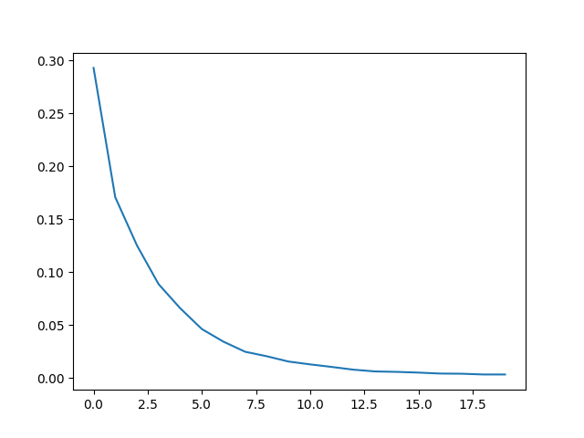

中文文本分类，Bert, RoBerta，基于pytorch，开箱即用。

## 中文数据集
目前数据来源于https://github.com/649453932/Bert-Chinese-Text-Classification-Pytorch


类别：财经、房产、股票、教育、科技、社会、时政、体育、游戏、娱乐。

 数据集划分  

| 数据集 | 数据量 |
| ---- | ---- |
|训练集|18万|
|验证集|1万|
|测试集|1万|

# 目录结构
```
bert_classification_raw/
├── data # 放数据
│   ├── xinwen #放数据
│   │    ├── acc.png # 训练时产生, 训练集、验证集正确率曲线
│   │    ├── loss.png # 训练时产生, loss下降曲线
│   │    ├── test_data_predict.csv # 行test.py得到的对test.csv的预测结果
│   │    ├── class.txt # 行号代表标签类别
│   │    ├── train.csv  # 训练数据
│   │    ├── train.csv  # 测试数据
│   │    └── dev.csv  # 验证数据
│   └─ models  # 训练中会产生模型存放在这里
├── config.py  # 配置文件
├── dataset.py # pytorch 文本数据整理成bert输入dataloader 
├── infer.py # 训练完成后,运行这个可以终端输入文本，输出结果 直接测试,并且这个文件不依赖其他文件，如果只用在预测，可以拷走这个文件和模型文件在里面配一下模型文件地址即可
├── model.py # 放写模型的代码
├── test.py # 对test.csv文件的整体测试结果,增加一列预测结果，保存到csv文件，文件位置在config.py中配置
├── train.py # 训练
└── utils.py  # 小的工具函数
```

# 更换自己的数据集
 1、在data下建立和xinwen一样的文件夹（包含train.csv,test.csv,dev.csv）

 2、在config.py中修改dir_name

# bert 训练曲线(10epoch)




# 具体参数可看config.py
```
# 训练
python train.py  # 会生成data/xinwen/acc.png,data/xinwen/loss.png,正确率和loss曲线
# 终端直接输入文本测试
python infer.py # 里面参数需要重新配置，不导入config
# test.csv测试
python test.py  # 会生成data/xinwen/test_pred_out
```

# 参考链接
https://github.com/649453932/Bert-Chinese-Text-Classification-Pytorch
