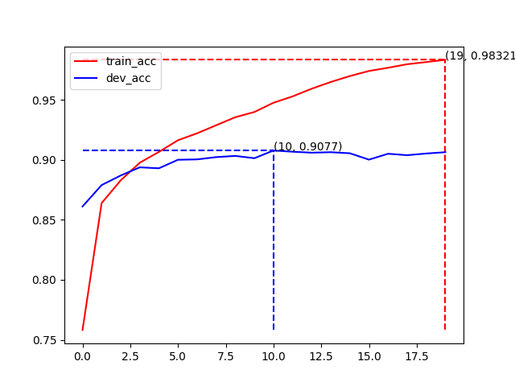
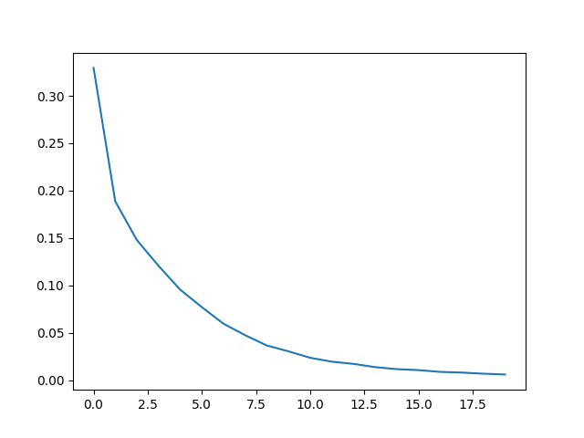
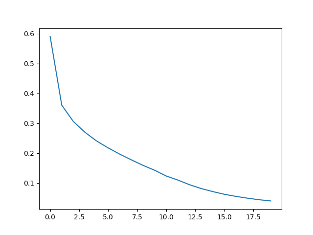
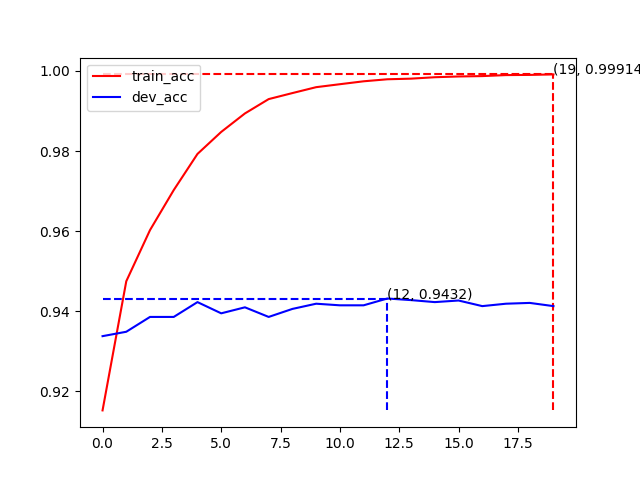
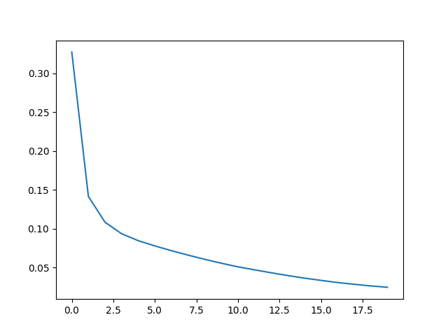

中文文本分类，Bert, RoBerta，ernie，albert,reformer 基于pytorch，开箱即用，支持单标签文本分类和多标签文本分类

## 中文数据集
### 单标签数据集(data/xinwen)
目前数据来源于https://github.com/649453932/Bert-Chinese-Text-Classification-Pytorch

类别：财经、房产、股票、教育、科技、社会、时政、体育、游戏、娱乐。

 数据集划分  

| 数据集 | 数据量 |
| ---- | ---- |
|训练集|18万|
|验证集|1万|
|测试集|1万|

train.csv示例, 这里class为数字，对应中文标签为data/xinwen/class.txt的行数

| text | class |
| ---- | ---- |
|中华女子学院：本科层次仅1专业招男生|3|
|两天价网站背后重重迷雾：做个网站究竟要多少钱|4|
|东5环海棠公社230-290平2居准现房98折优惠|1|
|... | ...|


### 多标签数据集(data/xinwen_multi_label)
数据来源：2020语言与智能技术竞赛：事件抽取任务

列表元素对应class.txt中的行数也就是标签个数，每个值，1则为包含该标签，0则不包含该标签

train.csv

| label | content | class |
| ---- | ---- | ---- |
['人生-结婚']|张杰幽默回应说错与谢娜结婚年份：必须上搓衣板|[0, 0, 0, 0, 0, 0, 0, 0, 0, 0, 0, 0, 0, 0, 0, 0, 0, 0, 0, 0, 1, 0, 0, 0, 0, 0, 0, 0, 0, 0, 0, 0, 0, 0, 0, 0, 0, 0, 0, 0, 0, 0, 0, 0, 0, 0, 0, 0, 0, 0, 0, 0, 0, 0, 0, 0, 0, 0, 0, 0, 0, 0, 0, 0, 0]|
['竞赛行为-胜负', '竞赛行为-晋级']|拒绝爆冷！王雅繁击败世界第184，韩国赛晋级第二轮|[0, 0, 0, 0, 0, 0, 0, 0, 0, 0, 0, 0, 0, 0, 0, 0, 0, 0, 0, 0, 0, 0, 0, 0, 0, 0, 0, 0, 0, 0, 0, 0, 0, 0, 0, 0, 0, 0, 0, 1, 0, 1, 0, 0, 0, 0, 0, 0, 0, 0, 0, 0, 0, 0, 0, 0, 0, 0, 0, 0, 0, 0, 0, 0, 0]|
['产品行为-发布']|华为正式发布鸿蒙OS，有四大技术特性|[0, 0, 0, 0, 0, 0, 0, 1, 0, 0, 0, 0, 0, 0, 0, 0, 0, 0, 0, 0, 0, 0, 0, 0, 0, 0, 0, 0, 0, 0, 0, 0, 0, 0, 0, 0, 0, 0, 0, 0, 0, 0, 0, 0, 0, 0, 0, 0, 0, 0, 0, 0, 0, 0, 0, 0, 0, 0, 0, 0, 0, 0, 0, 0, 0]|
['人生-婚礼']|唐艺昕婚礼现场激动落泪，与妈妈告别难掩悲伤，马思纯哭成泪人|[0, 0, 0, 0, 0, 0, 0, 0, 0, 0, 0, 0, 0, 0, 1, 0, 0, 0, 0, 0, 0, 0, 0, 0, 0, 0, 0, 0, 0, 0, 0, 0, 0, 0, 0, 0, 0, 0, 0, 0, 0, 0, 0, 0, 0, 0, 0, 0, 0, 0, 0, 0, 0, 0, 0, 0, 0, 0, 0, 0, 0, 0, 0, 0, 0]|

# 目录结构
```
bert_classification_raw/
├── data # 放数据
│   ├── xinwen #放数据
│   │    ├── {model}_acc.png # 训练时产生, 训练集、验证集正确率曲线
│   │    ├── {model}_loss.png # 训练时产生, loss下降曲线
│   │    ├── test_data_predict.csv # 行test.py得到的对test.csv的预测结果
│   │    ├── class.txt # 行号代表标签类别
│   │    ├── train.csv  # 训练数据
│   │    ├── test.csv  # 测试数据
│   │    └── dev.csv  # 验证数据
│   └─ models  # 训练中会产生模型存放在这里
├── config.py  # 配置文件
├── api.py  #   # 通过flask开启http服务, 5000端口 swagger页面, 需使用infer.py
├── dataset.py # pytorch 文本数据整理成bert输入dataloader 
├── infer.py # 训练完成后,运行这个可以在终端输入文本在线测试，并且这个文件不依赖其他文件，如果只用在预测，可以拷走这个文件和模型文件在里面配一下模型文件地址即可,目前配置是bert的
├── model.py # 放写模型的代码
├── test.py # 对test.csv文件的整体测试结果,增加一列预测结果，保存到csv文件，文件位置在config.py中配置
├── train.py # 训练
├── run.sh # 训练脚本，循环调用train.py 得到ernie、bert、bert_wwm、roberta、ernie_healthy, reformer等结果
└── utils.py  # 小的工具函数
```

# 更换自己的数据集
 1、在data下建立和xinwen一样的文件夹（包含train.csv,test.csv,dev.csv,class.txt）

 2、python train.py --model bert --dir_name xinwen --epochs 20 --batch_size 64

# 单标签（xinwen）训练曲线(20epoch)

model   |  acc             |  loss
:-------------------------:|:-------------------------:|:-------------------------:
bert |   |  
bert_wwm |   |  
roberta |   |  
ernie  |   |  
ernie_healthy  |   |  
albert  |   |  
reformer |   |  

# 多标签（xinwen_multi_label）训练曲线(10epoch)(目前计算正确率为所有标签全部正确才算正确)

model   |  acc             |  loss
:-------------------------:|:-------------------------:|:-------------------------:
bert |   |  
bert_wwm |   |  
roberta |   |  
ernie  |   |  
ernie_healthy  |   |  
albert  |   |  
reformer |   |  


# 具体参数可看train.py
```
# 训练
python train.py  # 会生成data/xinwen/acc.png,data/xinwen/loss.png,正确率和loss曲线
# 终端直接输入文本测试
python infer.py 
# test.csv测试
python test.py  # 会生成data/xinwen/test_pred_out
```

## 参考链接
https://github.com/649453932/Bert-Chinese-Text-Classification-Pytorch

## 码云地址
https://gitee.com/qukequke/bert-text-classification

## github地址
https://github.com/qukequke/bert_classfication/
